[Problem link in Codeforces](https://codeforces.com/group/dCXnuhjgqk/contest/688649/problem/K)

# Solution 

There are two ways to solve it, a brute force one and an elegant one, let us discover the elegant one first. 

## Elegant solution  

Rather than thinking of throwing bombs into the mine and then collecting gold, let us think in a different way. 

Firstly, note that we have the ability to collect all the gold in the grid by just throwing the bomb in some place 
and then moving it carefully and collecting the gold using the borders of the explosion, so forget the bomb and the explosion 
and only imagine in your mind this moving border as being a net. Now the problem is about this moving net. 

By using only our net, we can move it cell by cell and scrape the whole grid until we collect all the gold, but we face an issue, 
we need first of all to create this net one time only, and in the process of creating it, whatever is inside this net will vanish,
so our goal is to create this net in a way that will make us destroy the least amount of gold possible and if we can create it in a place in which we could lose 
no gold at all inside it, then this shall be great! In a nutshell, imagine a net scraping through the grid cell by cell, by this net we 
can easily collect all the gold, but first we need to create this net and in the process of creating it whatever was inside it is destroyed,
so our goal is to find a place in which if we created this net and then started scraping the grid with it, we collect the most gold possible.
But how to find this location? By looping through each cell and in each cell, we calculate the remaining gold after creating the 
net (throwing the bomb in this location) and we calculate this value by subtracting the destroyed gold within the bomb explosion 
from all the gold in the mine, we do this in every iteration in this loop and from one of these iterations, we get out the answer, the most 
possible amount of remaining gold after explosion and if in one of these iterations we found a location in which we can create the 
net once without losing any gold within it, then our answer is that we can collect all the gold and we break out of the loop in 
this special case (this is done for the sake of optimization).

### Pseudo Code

``` 
for (i=0; i<rows ; i++)
{ for ( j =0; j< cols ; j++) 
   { 

      create net in cell (i)(j); 

      allGold - gold destroyed inside the net = remaining gold that we can collect with the net;

      if -> no gold is destroyed when creating the net;

      then -> we can collect all the gold in the mine and no need to do any other iteration;

      else {

      compare remaining gold in this iteration with the remaining one before it; 

      answer = bigger remaining gold;

        }

      

      
     }
}
```
### Moving the net 

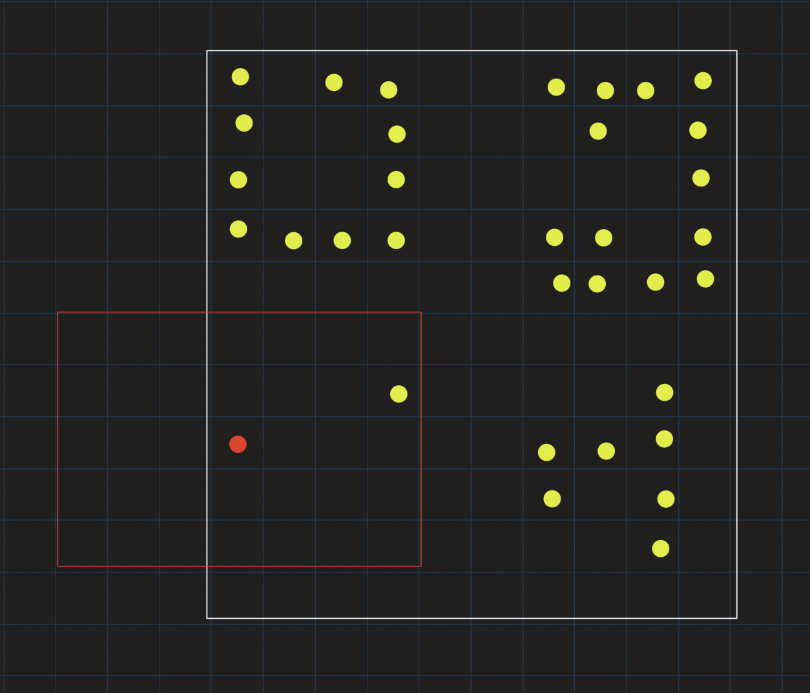

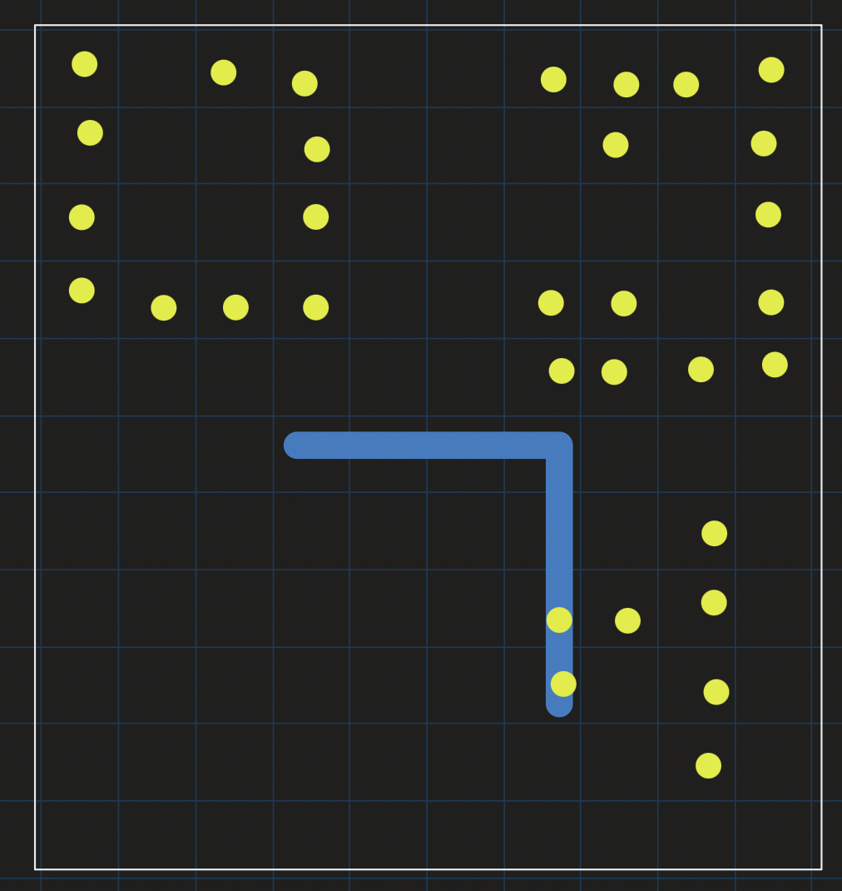

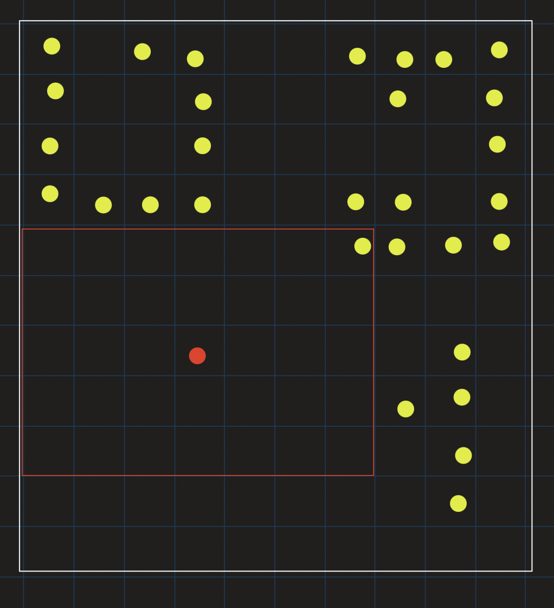
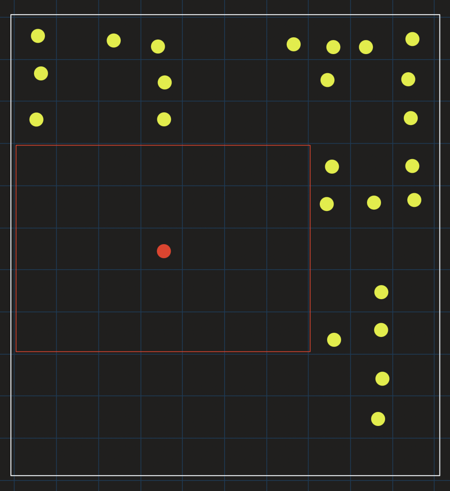
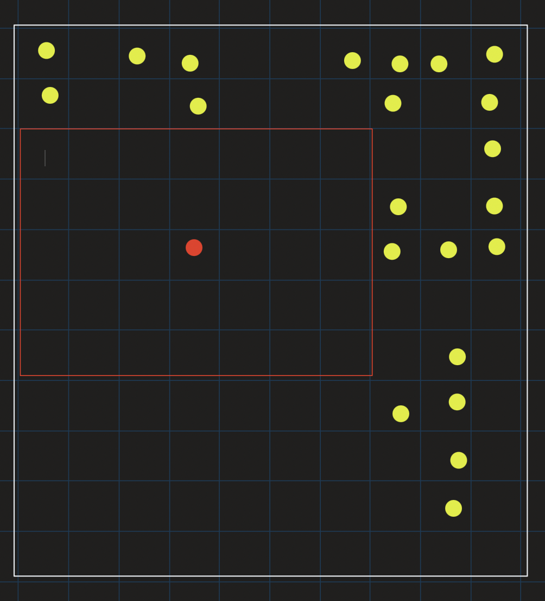
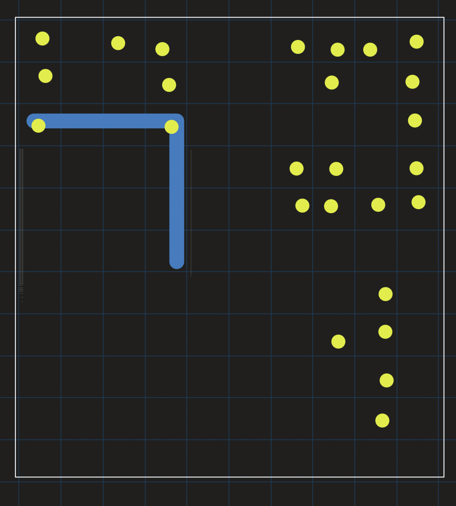
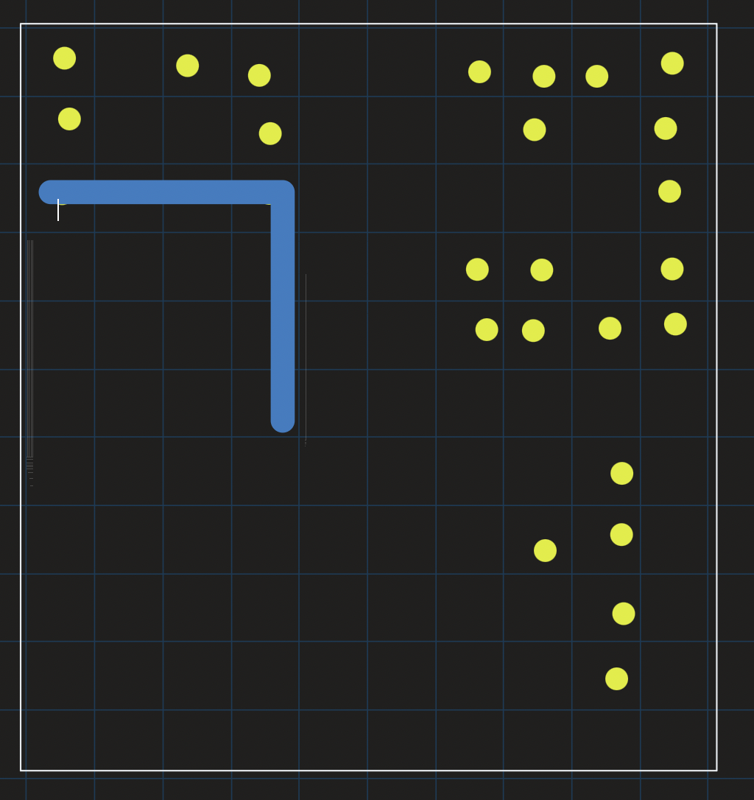
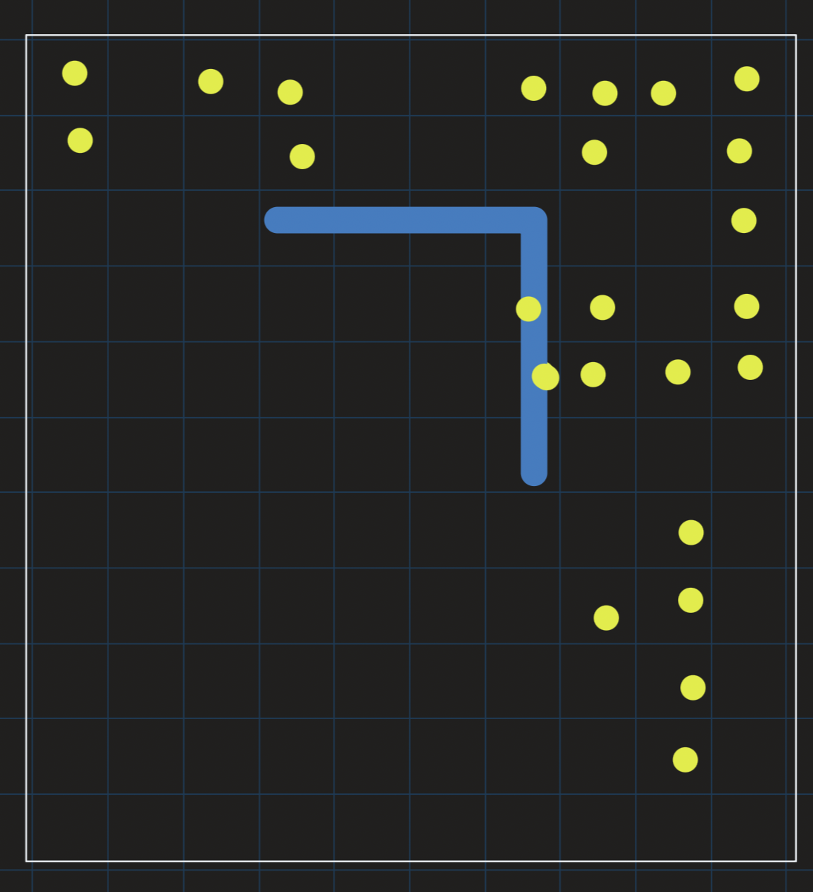
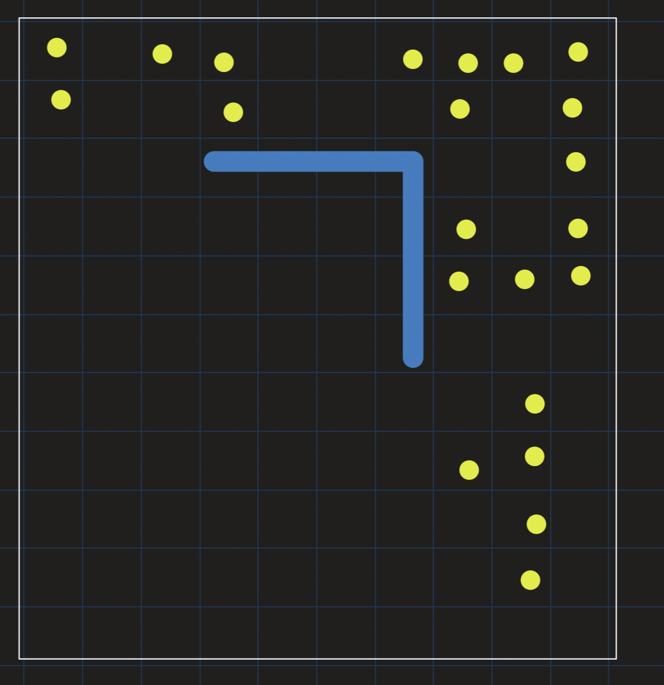
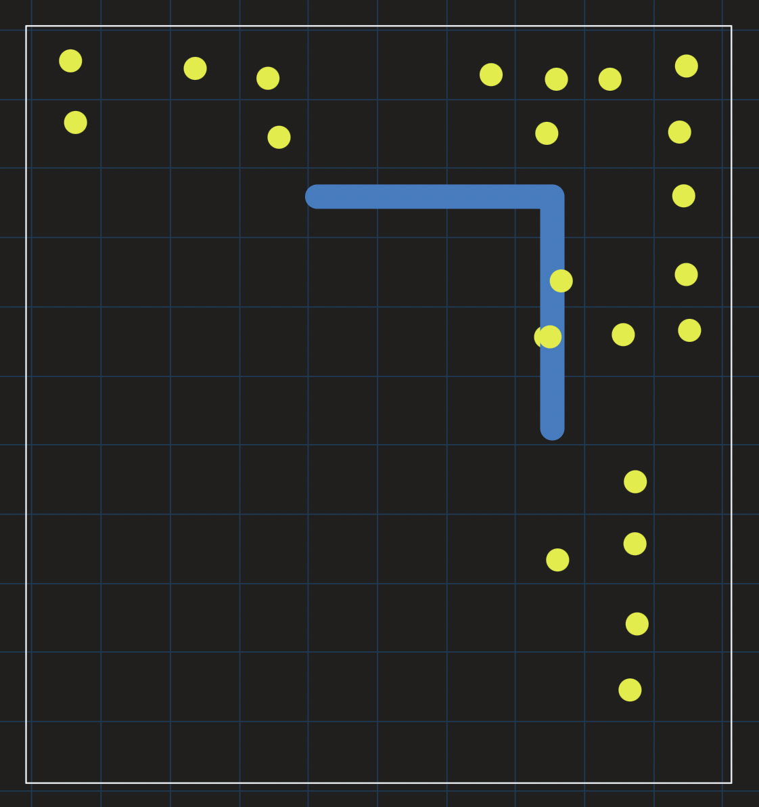
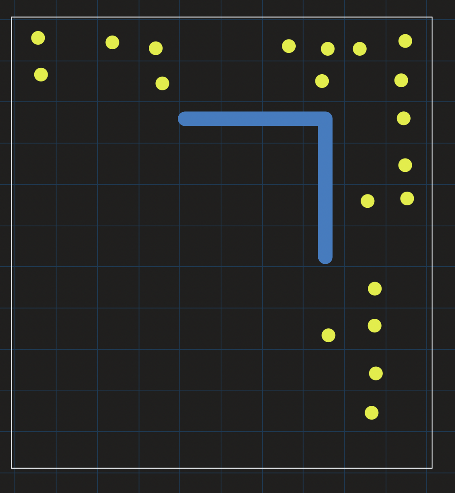


